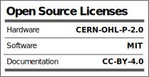

# spoonbot
Spoonbot is a social energy indicator robot pcb based on a CH32v003J4M6 microcontroller, using a thumbwheel potentiometer to light some or all of the 5 leds.  It was designed for a smd soldering workshop we ran with MCQN at DoES Livepool.

This repo contains the code for the microcontroller and a kicad version of the pcb design. Because we used JLC colour silkscreen for our badges the hardware folder is an export from EasyEDA. It is highly recommended that you run DRC on the pcb before exporting for production.

